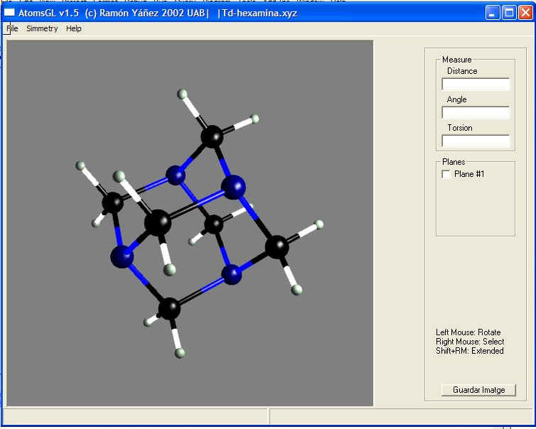



## AtomsGL

### Description

AtomsGL is a molecular viewer program. It uses OpenGL API to render a molecule on the screen. You can read several molecular files as PDB, XYZ and CIF.
 
### More Info
 
You need Glu32 library in order to execute this program.

             |
---                |---
**Submitted On**   |2002-11-12 00:05:04
**By**             |[Ramon Yanez](https://github.com/Planet-Source-Code/PSCIndex/blob/master/ByAuthor/ramon-yanez.md)
**Level**          |Advanced
**User Rating**    |4.8 (87 globes from 18 users)
**Compatibility**  |VB 5\.0, VB 6\.0
**Category**       |[Graphics](https://github.com/Planet-Source-Code/PSCIndex/blob/master/ByCategory/graphics__1-46.md)
**World**          |[Visual Basic](https://github.com/Planet-Source-Code/PSCIndex/blob/master/ByWorld/visual-basic.md)
**Archive File**   |[AtomsGL1531631192003\.zip](https://github.com/Planet-Source-Code/ramon-yanez-atomsgl__1-42568/archive/master.zip)

